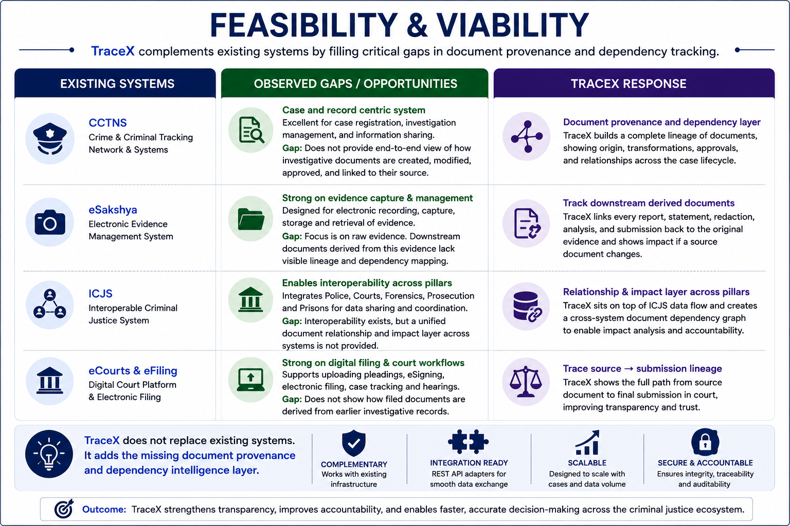
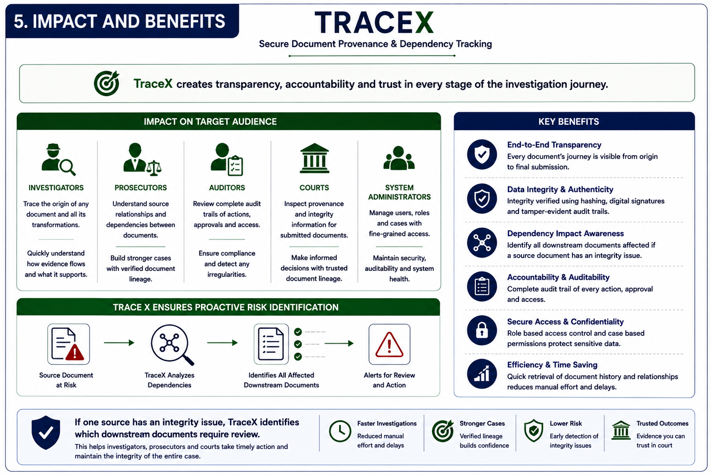
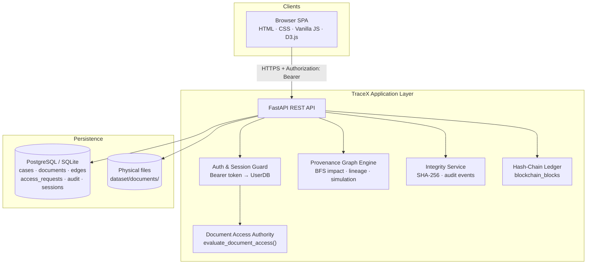
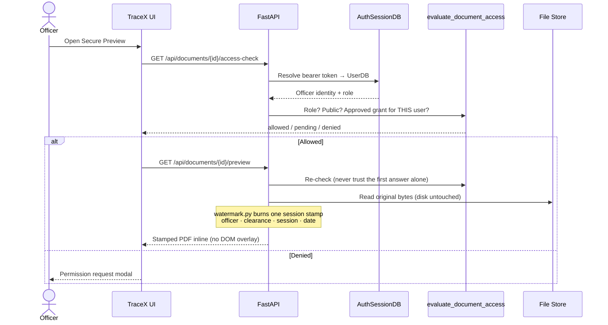
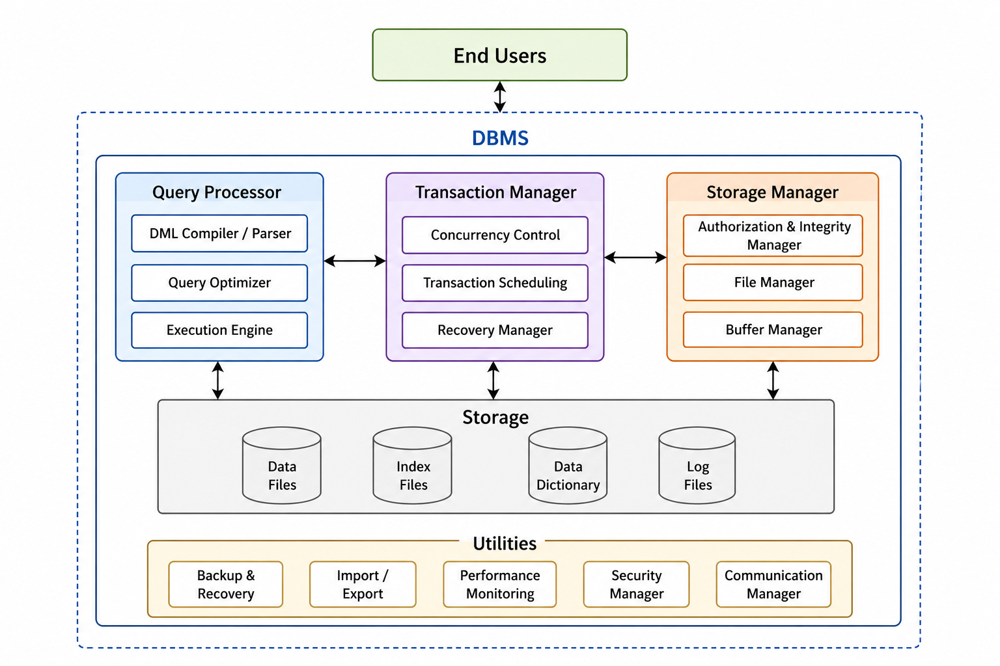
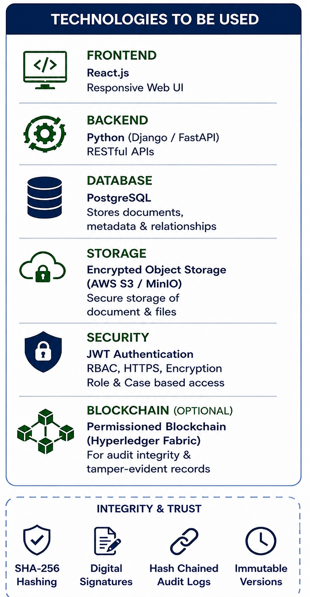
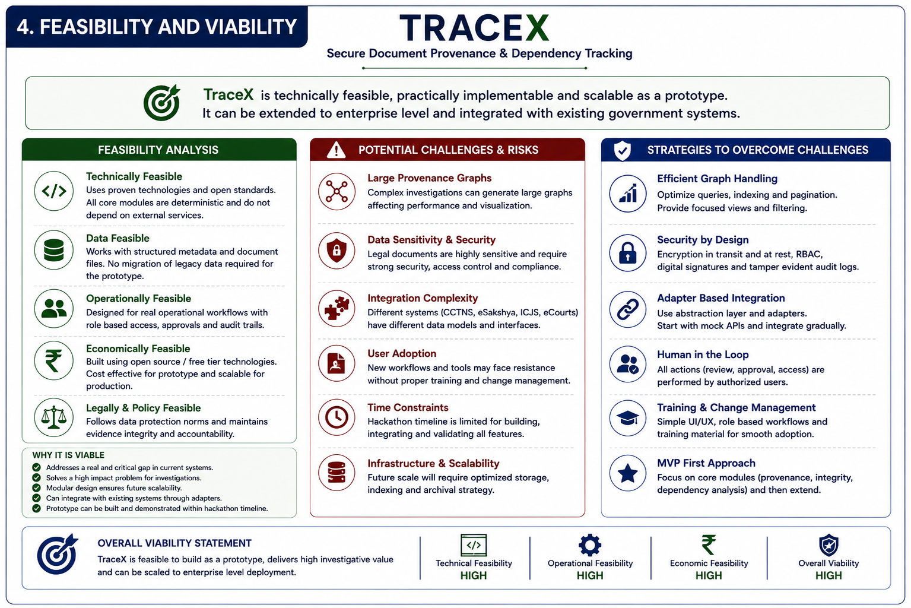
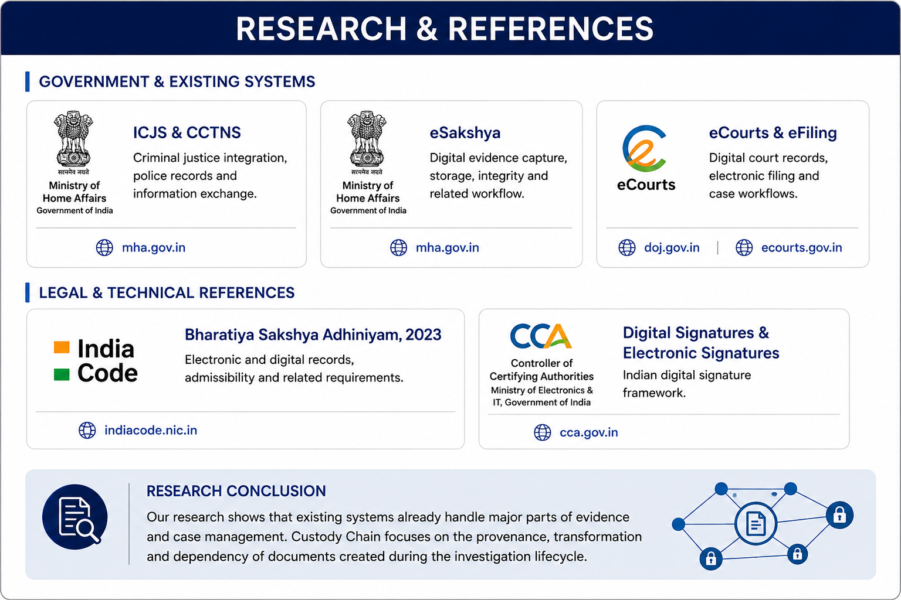

<p align="center">
  
</p>

<h1 align="center">TraceX</h1>

<p align="center">
  <strong>Secure Document Provenance &amp; Dependency Tracking</strong><br/>
  for law enforcement, forensics, prosecutors, and courts
</p>

<p align="center">
  <a href="#-quick-start"></a>
  <a href="#-architecture"></a>
  <a href="#-security--access-control"></a>
</p>

<p align="center">
  
  
  
  
  
</p>

---

## Why TraceX exists

Indian criminal-justice platforms already handle **registration, evidence capture, and filing**. What they do not show clearly is:

> *Where did this charge sheet come from? Which forensic report fed it? Who was cleared to open the witness statement? If the FIR was tampered with, which later papers must be reviewed?*

**TraceX fills that gap.** It is a provenance and custody layer that sits beside CCTNS, eSakshya, ICJS, and eCourts — not a replacement for them.

<p align="center">
  
</p>

---

## Impact & benefits

<p align="center">
  
</p>

| Stakeholder | What TraceX gives them |
|---|---|
| **Investigators** | Full lineage from FIR → seizure → forensic → charge sheet |
| **Supervisors (SP)** | Per-officer clearance queue; approvals do not leak across users |
| **Forensic officers** | Own clearances only; cannot inherit another officer’s grant |
| **Prosecutors** | Verified relationships between case documents |
| **Courts / Magistrates** | Public court copies with PII removed; original stays confidential |
| **Auditors** | Tamper blast radius, audit trail, and hash-chain verification |

---

## What you can demo today

| Capability | Status | What it proves |
|---|---|---|
| Hierarchical provenance graph (D3) | Live | Case file as a DAG, not a folder |
| Type-coloured nodes + legend filters | Live | FIR / witness / forensic / charge sheet at a glance |
| Bearer-token sessions (server-side) | Live | Client cannot assert another officer’s identity |
| Supervisor access queue | Live | Clearance bound to **one** requester ID |
| Secure preview (no download) | Live | Session-stamped PDF only; original on disk untouched |
| Court copy / PII redaction | Live | Public node linked with `redacted_from` |
| Counterfactual impact simulation | Live | “What if this FIR failed?” — **writes nothing** |
| Tamper + downstream review | Live | Integrity issue → blast radius of dependents |
| Hash-chain ledger + verify | Live | Official acts sealed to previous block |
| Upload → new graph node | Live | Case, type, parents, relationship, eSign stub, ledger block |

---

## Architecture

### System overview



### Request path for a sensitive document



### Provenance model

Documents are nodes. Relationships are directed edges.

| Relationship | Meaning |
|---|---|
| `derived_from` | Built using an earlier document |
| `redacted_from` | Public court copy of a confidential source |
| `translated_from` | Language / regional translation |
| `revised_from` | Updated investigation record |
| `referenced_from` | Cited by a later filing |
| `merged_from` / `summarized_from` | Composite / condensed work product |

If document **A** is compromised, TraceX walks **downstream** and marks dependents for review. Counterfactual simulation uses the same walk **without writing** to the database.

### Database layer

<p align="center">
  
</p>

**Core tables TraceX uses**

| Table | Role |
|---|---|
| `users` | Officers, roles, demo credentials |
| `auth_sessions` | Server-side bearer tokens + expiry |
| `cases` | Case metadata |
| `documents` | Title, type, classification, hash, file path, integrity status |
| `provenance_edges` | Source → target relationships |
| `access_requests` | Pending / approved / revoked clearances (per officer) |
| `blockchain_blocks` | Hash-linked official-act ledger |
| `audit_logs` | Who opened, denied, uploaded, approved |
| `versions` / `integrity_events` | Version history and tamper detections |
| `police_assets` | Seized physical / digital assets |

---

## Security & access control

### Principles

1. **Identity comes from the token**, never from `?user_role=` or a body field.
2. **Clearance is per officer.** Approving Vikram for DOC-002 does **not** unlock DOC-002 for Malviya.
3. **Preview is the only path to original bytes.** There is no download route. Bytes that leave the server are **session-watermarked** (see below); the file on disk is never rewritten.
4. **Every open / denial is audited.**
5. **Official mutations append a ledger block** (upload, court copy).

### Session watermark (secure preview)

TraceX does **not** rely on a DOM overlay. On every allowed `GET /api/documents/{id}/preview`, `backend/watermark.py` burns **one** soft-red attribution stamp into the response PDF/image bytes before they leave the server.

| Stamp line | Source (live request only) |
|---|---|
| Officer name + role | `UserDB` from the validated bearer session |
| Badge · user id · department | `UserDB` |
| Case / document · classification | `DocumentDB` |
| Clearance reason · request id · expiry date | `evaluate_document_access()` verdict |
| Session suffix · view **date** | Bearer token suffix + `YYYY-MM-DD` (no clock time) |

**Why this matters for cybersecurity:** DevTools cannot strip an HTML watermark; a photographed or saved preview still names the viewing officer and clearance. The stored original under `dataset/documents/` stays clean for integrity / hash-chain checks. Response headers include `X-TraceX-Watermark: session-bound` and `Cache-Control: no-store`.

### Who can read what

| Caller | Public Record | Confidential / Restricted |
|---|---|---|
| Supervisor (SP) | Yes | Yes (role privilege) |
| Court Officer | Yes | Yes (role privilege) |
| Investigator / Forensic / Prosecutor / Auditor | Yes | Only with **their own** approved grant |
| Anonymous | No | No |

### Hash-chain ledger (what “blockchain” means here)

TraceX does **not** put PDFs on a public coin network. It keeps a **permissioned hash chain** in `blockchain_blocks`:

```text
block_hash = SHA-256( previous_hash + document_content_hash + block_number )
```

- Each official act (upload, court copy) appends a block that points at the previous hash.
- `GET /api/blockchain/verify` walks the chain → `INTACT` or `CORRUPTED`.
- Viewing a file is logged in **audit**, not on the chain. The chain records **committed official versions**.

<p align="center">
  
</p>

> **Honest scope:** this is a departmental hash-chain. A national deployment would also anchor daily tip hashes at a second authority (e.g. NIC) so one DBA cannot rewrite the whole book alone.

---

## Technology stack

| Layer | Choice | Why |
|---|---|---|
| API | **FastAPI** + Uvicorn | Typed routes, Fast dependencies for auth |
| ORM | **SQLAlchemy** | Postgres in Docker, SQLite for local demos |
| Frontend | **Vanilla JS + D3.js v7** | Zero-build SPA; provenance graph is first-class |
| UI theme | Government of India light theme | Navy / saffron / India green — presentation-ready |
| Crypto | **SHA-256**, session bearer tokens, PDF/image stamp | Fingerprints + server-side sessions + preview attribution |
| Files | Local `dataset/documents/` | PDF / TXT with traversal-safe names |
| Tests | **pytest** + FastAPI TestClient | Access-leak, preview, court copy, simulation |
| Deploy | Docker Compose (app + Postgres 15) | One-command stack |

---

## Repository layout

```text
SIH2026/
├── backend/
│   ├── app.py              # REST API, auth, RBAC, upload, ledger, preview
│   ├── database.py         # SQLAlchemy models + seed from CSV
│   ├── provenance.py       # DAG engine: impact, explain, simulate
│   ├── integrity.py        # SHA-256 + in-memory audit helper
│   ├── watermark.py        # Session-bound PDF/image stamp for preview
│   ├── models.py           # Pydantic / domain enums
│   └── seed_data.py        # Rich demo case content
├── static/
│   ├── index.html          # TraceX SPA shell
│   ├── css/styles.css      # GoI light theme
│   └── js/
│       ├── app.js          # Controllers, auth header, repository
│       ├── graph.js        # Hierarchical provenance graph
│       ├── viewer.js       # Secure preview (no DOM watermark)
│       └── audit.js        # Court copy + impact simulation UI
├── dataset/
│   ├── documents/          # Physical case files
│   └── metadata/           # CSV seed (users, docs, edges, audits)
├── tests/                  # pytest suite
├── assets/                 # README diagrams & TraceX mark
├── docker-compose.yml
├── Dockerfile
├── render.yaml             # Render Blueprint (public HTTPS demo)
├── PYTHON_VERSION          # Render Python runtime
├── scripts/render_start.sh # Render start: init_db + uvicorn
└── requirements.txt
```

---

## Quick start

### Option A — Local (SQLite, fastest)

```bash
git clone https://github.com/prathmeshkulkarni-coder/SIH2026.git
cd SIH2026

python3 -m venv .venv
source .venv/bin/activate          # Windows: .venv\Scripts\activate
pip install -r requirements.txt

cp .env.example .env               # default POSTGRES_URL is already SQLite
python -c "from backend.database import init_db; init_db()"

uvicorn backend.app:app --host 0.0.0.0 --port 8000 --reload
```

Open **http://localhost:8000**

Or use the helper:

```bash
./run.sh
```

### Option B — Docker (Postgres)

```bash
cp .env.example .env
# set DB_PASSWORD and point POSTGRES_URL / DATABASE_URL at the compose service

docker compose up --build
```

- App: http://localhost:8000  
- Postgres published on host port **5433**

### Option C — Render (public HTTPS demo)

Config is already in the repo: `render.yaml`, `scripts/render_start.sh`, `PYTHON_VERSION`.

1. Push latest `main` to GitHub (Render deploys from the remote).
2. Open [https://dashboard.render.com](https://dashboard.render.com) → **New** → **Blueprint**.
3. Connect `prathmeshkulkarni-coder/SIH2026` and apply the Blueprint.
4. Wait for the first deploy. Open the service URL (e.g. `https://tracex-xxxx.onrender.com`).

**Free plan notes**

- Uses **SQLite** on the instance disk (re-seeds after a wipe/redeploy). Fine for jury demos.
- Free web services **spin down** after idle; the first request can take ~30–60s.
- Demo logins stay the same (`vikram` / `password123`, etc.).

**Durable Postgres (optional)** — create a free DB on [Neon](https://neon.tech) or [Supabase](https://supabase.com), then in the Render service → **Environment** set:

```text
POSTGRES_URL=<your postgres connection string>
DATABASE_URL=<same string>
```

Redeploy. `init_db()` creates tables and seeds once when empty.

**Manual (no Blueprint):** New → Web Service → this repo → Runtime **Python** → Build `pip install -r requirements.txt` → Start `bash scripts/render_start.sh` → add the same env vars as in `render.yaml`.

---

## Demo accounts

Password for all seeded users: **`password123`**

| Username | Role | Use in the demo |
|---|---|---|
| `vikram` | Investigator | Request access, upload, create court copy |
| `priya` | Investigator | Second IO (shows grants do not cross users) |
| `drsen` | Supervisor (SP) | Approve access queue |
| `malviya` | Forensic Analyst | Prove Vikram’s grant does **not** unlock for lab |
| `magistrate` | Court Officer | Open public court copies without extra clearance |
| `deshmukh` | Prosecutor | Case review persona |
| `raman` | Auditor | Audit / integrity persona |

### Suggested 8-minute story

1. Login as **vikram** → open provenance graph (CASE-001).  
2. Try a confidential node → request access → logout.  
3. Login as **drsen** → approve Vikram only.  
4. Login as **malviya** → same document still locked.  
5. Login as **vikram** → **Open Secure Preview** (no download).  
6. **Create Court Copy** → new public node with `redacted_from`.  
7. Login as **magistrate** → open the public copy.  
8. **Counterfactual Impact Simulation** on DOC-001 → then optional tamper demo.  
9. Blockchain tab → **Verify** chain intact.

---

## Key API surface

| Method | Path | Purpose |
|---|---|---|
| `POST` | `/api/auth/login` | Issue bearer session |
| `POST` | `/api/auth/logout` | End session; revoke that officer’s grants |
| `GET` | `/api/cases/{id}/graph` | Nodes + links for the DAG |
| `GET` | `/api/documents/{id}/access-check` | Server verdict for UI badges |
| `GET` | `/api/documents/{id}/preview` | Session-watermarked PDF (authz + audit; original untouched) |
| `POST` | `/api/access-requests` | Request clearance (requester = token) |
| `POST` | `/api/access-requests/{id}/approve` | SP only |
| `POST` | `/api/documents/upload` | New node + parents + ledger block |
| `POST` | `/api/documents/{id}/redact` | Public court copy |
| `POST` | `/api/simulation/impact` | Non-destructive blast-radius preview |
| `POST` | `/api/documents/{id}/trigger-tamper` | Demo integrity failure |
| `GET` | `/api/blockchain` | List ledger blocks |
| `GET` | `/api/blockchain/verify` | Walk previous-hash links |

Interactive docs (when server is up): **http://localhost:8000/docs**

---

## Testing

```bash
source .venv/bin/activate
python -m pytest tests/ -q
```

Coverage includes authentication, per-officer access isolation, preview authorisation, court-copy immutability of the source, impact simulation (no DB writes), and ledger verification.

---

## Feasibility

<p align="center">
  
</p>

TraceX is intentionally **MVP-first**: provenance graph, integrity, RBAC, and dependency impact ship before full NIC eSign or multi-agency ledger anchoring. Adapter-style integration keeps CCTNS / ICJS / eCourts as sources of truth for registration and filing.

---

## Research & legal context

<p align="center">
  
</p>

Designed with reference to:

- **Bharatiya Sakshya Adhiniyam, 2023** — electronic records & admissibility  
- **CCA / MeitY** — digital / electronic signature framework  
- **CCTNS · ICJS · eSakshya · eCourts** — existing MHA / DoJ systems TraceX complements  

---

## Roadmap (honest)

| Now (prototype) | Next |
|---|---|
| SHA-256 content fingerprints | Full Merkle trees per batch |
| Simulated eSign JSON | NIC / CCA eSign integration |
| Plaintext demo passwords | bcrypt + Parichay / SSO |
| Single-DB hash chain | Daily tip-hash anchor at second authority |
| Local file store | Encrypted object storage (S3 / MinIO) |

---

## Team / hackathon

Built for **Smart India Hackathon** — Problem Statement **SIH26190**  
Product name: **TraceX** · Domain: NCRB / Ministry of Home Affairs secure document lifecycle

---

## License

Hackathon prototype — see repository for team licensing decisions.

---

<p align="center">
  <br/>
  <sub>TraceX — see the chain, not just the file.</sub>
</p>
